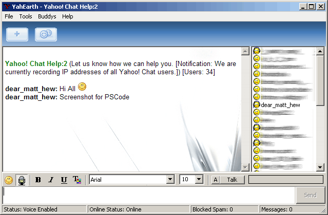



## YahEarth \- Another Yahoo Messenger Clone \(Scripting/Voice/Font Styles/Buddys/PM/Captcha\)

### Description

NOTE: Do not E-Mail me for questions like "Can you update ..." I'm not going to, if you don't get the point of Planet Source Code then you should stop immdiatly Programming. Not only that you bother me with useless questions, you are also an bunch of untalented people. If you plan to learn something then don't let other do the work.

----

This is a pretty done clone of the original Yahoo Messenger Client. This Clone includes Voice, Scripting (VBS), Smileys, Full Font Style Parsing, PM's, Buddy List, Chat Filter, Ignore List, Advanced Boot Protection, Clean &amp; Professional Interface, YMSG12-YMSG15 Protocol Support. The Scripting feature is all done by runtime events like Outgoing Message/Ingoing Message and alot more, its using the VBS Control system and is also adding all the Objects of the Forms to make them accessable by the VBS Control, theres also a Class for the VBS Control where are functions located that can be used runtime by scripting. The Boot Protection works easy, its counting all packets of the Users if there are more than 3 Packets in less or an second it will ignore these Packets and automaticly Ignore the User. The Font Style Parsing is all done by HTML and the IE Object, its using advanced functions to trim HTML or modify it while its receiving Data, this makes it more easier and comfortable for the end-users. YahEarth is also using the newest Smileys from the Original Yahoo Messenger and can be modified/added without re-compiling the whole Source Code. The Interface and buttons can be modified by the Resource Files (Pictures/Settings) and also have runtime options to modify the style of the GUI. The Client is able to handle the new YMSG15 Protocol for MSN Live Chat &amp; Buddys, the Packets are not much different but atleast i got it work with YMSG15. I've worked on this for serval Months, Im pretty sure this Project was started in 2005 and i believe its time to share it now!

*FIXED* Compiling Error

*ADDED* Chat Captcha Window (You can now use the Chat again)
 
### More Info
 

             |
---                |---
**Submitted On**   |2008-03-05 04:36:50
**By**             |[cIntX](https://github.com/Planet-Source-Code/PSCIndex/blob/master/ByAuthor/cintx.md)
**Level**          |Intermediate
**User Rating**    |3.4 (27 globes from 8 users)
**Compatibility**  |VB 5\.0, VB 6\.0, VB Script
**Category**       |[Internet/ HTML](https://github.com/Planet-Source-Code/PSCIndex/blob/master/ByCategory/internet-html__1-34.md)
**World**          |[Visual Basic](https://github.com/Planet-Source-Code/PSCIndex/blob/master/ByWorld/visual-basic.md)
**Archive File**   |[YahEarth\_\-210511372008\.zip](https://github.com/Planet-Source-Code/cintx-yahearth-another-yahoo-messenger-clone-scripting-voice-font-styles-buddys-pm-captcha__1-69039/archive/master.zip)

